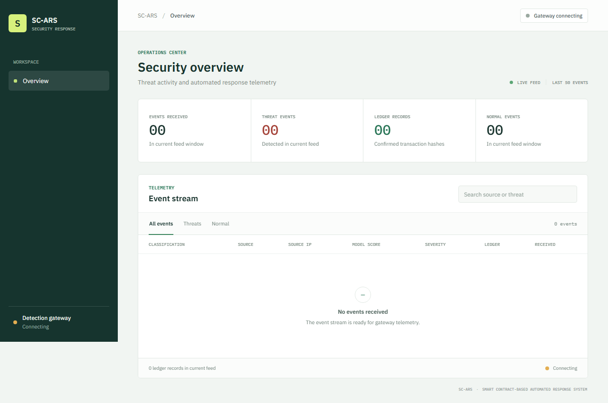

# SC-ARS: Smart Contract-Based Automated Response System

SC-ARS is a research prototype for automated, blockchain-backed threat response in Web3 and Internet-of-Things environments. The system combines:

- a Solidity smart contract for recording and mitigating threat events,
- an ML-based detection gateway for IoT and network traffic analysis,
- an MQTT/WebSocket layer for live threat monitoring,
- a Next.js dashboard for visualizing system activity.

The project is aligned with the broader concept of using on-chain incident reporting and automated mitigation workflows to support trust, traceability, and response coordination in distributed environments.

## Paper / publication

This repository accompanies the published SC-ARS research paper. The permanent publication links are:

- [E3S Web of Conferences article](https://www.e3s-conferences.org/articles/e3sconf/abs/2026/53/e3sconf_ai-scities2026_03001/e3sconf_ai-scities2026_03001.html)
- [ResearchGate publication](https://www.researchgate.net/publication/412749519_Smart_Contract-Based_Automated_Response_System_for_IoT_Attacks_in_Web3_Ecosystems?__cf_chl_tk%3DiwLbidcBQeNJKhrPWccC0sh8j_xU3lf2boVTLBmd0Uw-1790603464-1.0.1.1-k1UBN.47V8mndgP1tJ..iZopAP.04SXR36Hy.T7X6o0)

## Project goals

- Detect suspicious activity from IoT or network telemetry using trained ML pipelines.
- Convert detections into structured threat reports.
- Store threat records on-chain for auditability and traceability.
- Trigger mitigations and log response actions.
- Expose monitoring and status updates through a local dashboard and real-time stream.

## Dashboard preview



## System architecture

### 1. Smart contract layer

The Solidity contract in [contracts/SCARS.sol](contracts/SCARS.sol) defines the threat-report lifecycle:

- `reportThreat(...)` records a device ID, threat type, severity, and anomaly score.
- `mitigateThreat(...)` marks a stored threat as mitigated.
- `getThreats(...)` retrieves prior reports for a device.

This provides an immutable ledger of security events that can be reviewed or acted upon by an authorized admin.

### 2. ML detection gateway

The Python service in [ml_gateway/main.py](ml_gateway/main.py) exposes a FastAPI API with:

- `POST /predict` for inference on incoming telemetry features
- `POST /mitigate` for mitigation logging and response actions
- WebSocket endpoint at `/ws` for live event streaming

The gateway loads pre-trained ML pipelines for different datasets:

- NSL-KDD
- CICIDS sample pipeline

Each pipeline performs:

- feature scaling,
- selector-based filtering,
- PCA transformation,
- model inference,
- optional mitigation trigger when a threat is identified.

### 3. MQTT and live monitoring

The project includes MQTT utilities and WebSocket management for streaming detection summaries to local interfaces. This supports live monitoring of model output and mitigation events.

### 4. Frontend dashboard

The Next.js app under [sc-ars-dashboard](sc-ars-dashboard) provides a browser-based UI for monitoring system alerts and the live threat stream.

## Repository layout

- [contracts/SCARS.sol](contracts/SCARS.sol) — Solidity smart contract
- [scripts](scripts) — Hardhat deployment and contract interaction scripts
- [ml_gateway](ml_gateway) — Python ML + API gateway
- [sc-ars-dashboard](sc-ars-dashboard) — Next.js dashboard
- [test](test) — Hardhat contract tests
- [mitigation_log.txt](mitigation_log.txt) — mitigation output log
- [requirements.txt](requirements.txt) — Python dependencies
- [hardhat.config.ts](hardhat.config.ts) — Hardhat configuration

## Prerequisites

- Node.js 18+
- npm
- Python 3.10+
- Git LFS (for the large trained model files)
- A local blockchain node or test network

## Environment setup

### Python

```bash
python -m venv venv
# Windows PowerShell
.\venv\Scripts\Activate.ps1
pip install -r requirements.txt
```

### Node / Hardhat

```bash
npm install
npx hardhat compile
```

### Local blockchain

```bash
npx hardhat node
```

Then, in another terminal, deploy the contract:

```bash
npx hardhat run scripts/deploy-scars.ts --network localhost
```

## Run the gateway

From the project root:

```bash
uvicorn ml_gateway.main:app --host 0.0.0.0 --port 8000 --reload
```

This exposes:

- the prediction API,
- mitigation endpoint,
- live WebSocket monitor,
- a simple HTML dashboard route at `/dashboard`.

## Run the dashboard

```bash
cd sc-ars-dashboard
npm install
npm run dev
```

The dashboard is typically served at:

- [http://localhost:3000](http://localhost:3000)

## Example flow

1. A device or telemetry source sends data to the ML gateway.
2. The model predicts whether the input matches suspicious behavior.
3. If a threat is identified, the backend can trigger a mitigation action.
4. The event is recorded to the SCARS smart contract.
5. A local dashboard and stream receive updates from the gateway.

## Important notes

- The trained ML model artifacts under [ml_gateway/models](ml_gateway/models) are large and are tracked with Git LFS.
- Secrets such as blockchain keys and RPC URLs should be kept in a local environment file such as `ml_gateway/config.env` and should not be committed to source control.
- This repository is a research and prototyping codebase and is intended to be extended for production deployment and stronger operational controls.

## Typical next workstreams

- harden contract access patterns and admin authorization,
- connect the gateway to real IoT telemetry sources,
- expand dashboard analytics and alert history,
- add secure deployment automation for testnets and mainnets,
- improve model packaging and versioning strategy.

## Project execution plan

The repository is structured around the four layers described in the research paper:

1. threat detection gateway,
2. smart contract response layer,
3. gateway-to-contract orchestration,
4. live monitoring dashboard.

The implementation plan is documented in [docs/project-plan.md](docs/project-plan.md).

## License

This project is distributed for research and development purposes. Please review the repository contents and any local deployment environment before using it in production systems.

## Related work

This repository reflects a smart-contract-based response system for security automation in digital ecosystems and is intended to support continued research and engineering work around automated threat response and trustable cyber-defense orchestration.
